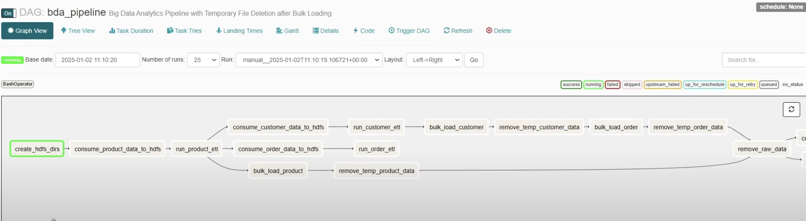

# Optimizing eCommerce Business with Big Data Architecture and Solutions Using the Hadoop Ecosystem

## Table of Contents

## Architecture Overview
This project demonstrates a robust big data architecture for handling and processing real-time and large-scale e-commerce data. The architecture integrates various technologies in the Hadoop ecosystem, complemented by Apache Kafka for real-time data ingestion, Apache Spark for advanced data analysis, and Python-based dashboards for visualization.

### Architecture Workflow

1. **Data Ingestion**:
   - Real-time data from POS systems is ingested using **Apache Kafka**.
   - Data is loaded into **HDFS** in batches of 50 rows whenever new data arrives.

2. **Data Cleaning & Preprocessing**:
   - Raw data in HDFS undergoes a **MapReduce job** for cleaning.
   - The cleaned data is stored back in HDFS.

3. **Conversion to HFiles**:
   - Another **MapReduce job** converts the cleaned data into **HFiles**.
   - These HFiles are bulk-loaded into **Apache HBase**.

4. **Clean Data Store**:
   - Data in HBase is fully cleaned and optimized for direct user queries.
   - **Thrift Server** connects Python-based EDA scripts to HBase for exploratory data analysis (EDA).

5. **Data Analysis**:
   - **Apache Spark** processes the cleaned data in HDFS to perform advanced analytics.
   - Python scripts define and run the analysis tasks.

6. **Dashboards**:
   - A Python-based **EDA dashboard** visually presents the exploratory data analysis results from HBase.
   - A Python-based **BI dashboard** displays analysis results from Spark.

7. **Airflow Integration**:
   - The entire flow is orchestrated using **Apache Airflow** for seamless execution and scheduling.

### Architecture Diagram

Below is the visual representation of the architecture:


### Key Features

- Real-time and batch data handling capabilities.
- Scalable and optimized for large-scale e-commerce datasets.
- User-friendly dashboards for data exploration and business intelligence.
- Seamless integration of all components through Apache Airflow for automation.

This architecture is designed to handle real-time POS data and bulk data ingestion, providing a complete big data solution for e-commerce platforms.

## Setup Guide

### Prerequisites

### Docker Containers Setup

#### Setting Up Hadoop NameNode

##### Step 1: Prepare the Project Directory
1. **Create a folder for the project**:
   Create a directory for the BDA Project.
   ```bash
   mkdir BDA_Project
   cd BDA_Project
   ```

2. **Move the Hadoop Compose File**:
   Copy the `docker-compose-hadoop.yml` file from the `All Docker Compose Files` folder to the `BDA_Project` folder.
   ```bash
   mv ../All_Docker_Compose_Files/docker-compose-hadoop.yml .
   ```

##### Step 2: Start Hadoop Containers
1. **Compose Up the Hadoop Containers**:
   Run the `docker-compose` command to start the Hadoop cluster.
   ```bash
   docker-compose -f docker-compose-hadoop.yml up -d
   ```

2. **Check the Running Containers**:
   Verify that the containers are running.
   ```bash
   docker ps
   ```


##### Step 3: Access the NameNode
1. **Enter the NameNode Container**:
   Use the following command to enter the NameNode container.
   ```bash
   docker exec -it hadoop-namenode-bda /bin/bash
   ```


##### Step 4: Create and Copy Hadoop Configuration Archive
1. **Create a TAR Archive of the Hadoop Directory**:
   Tar the Hadoop folder to allow its configurations to be moved across containers.
   ```bash
   tar -czvf hadoop-3.2.1.tar.gz hadoop-3.2.1/
   ```

2. **Copy the TAR Archive to Local Machine**:
   Use `docker cp` to move the archive from the container to your local machine.
   ```bash
   docker cp hadoop-namenode-bda:/hadoop-3.2.1.tar.gz .
   ```


##### Step 5: Configure NameNode Environment
1. **Set Paths and Create JAR Files**:
   Inside the NameNode container, run the following commands step by step:

   - **Check JAVA_HOME**:
     ```bash
     echo $JAVA_HOME
     ```

   - **Set Path Variables**:
     ```bash
     export PATH=$JAVA_HOME/bin:$PATH
     echo $HADOOP_HOME
     export HADOOP_HOME=/opt/hadoop-3.2.1
     export PATH=$HADOOP_HOME/bin:$PATH
     ```

   - **Create Necessary Directories and JAR Files**:
     ```bash
     mkdir -p classes
     hadoop com.sun.tools.javac.Main -d classes /tmp/*.java
     ```

2. **Update Bash Configuration**:
   Append Hadoop and HBase paths to the bash configuration file for persistent use:
   ```bash
   echo "export HBASE_HOME=/hbase/hbase-1.2.6" >> ~/.bashrc
   echo "export HADOOP_CLASSPATH=\$(find \$HADOOP_HOME/share/hadoop -name \"*.jar\" | tr '\n' ':'):\$HBASE_HOME/lib/*" >> ~/.bashrc
   echo "export PATH=\$PATH:\$HADOOP_HOME/bin:\$HADOOP_HOME/sbin:\$HBASE_HOME/bin" >> ~/.bashrc
   source ~/.bashrc
   ```


##### Step 6: Set Up HDFS for Airflow
1. **Create Airflow Directory in HDFS**:
   ```bash
   hdfs dfs -mkdir -p /user/airflow
   ```

2. **Change Ownership and Permissions**:
   Provide necessary access to the `airflow` user.
   ```bash
   hdfs dfs -chown airflow:supergroup /user/airflow
   hdfs dfs -chmod 775 /user/airflow
   ```

You have now successfully set up the Hadoop NameNode and configured it for both distributed file system access and integration with Airflow. Proceed to set up the remaining components or workflows.

#### Setting Up Kafka, HBase, Spark, and Dashboard Containers

##### Step 1: Prepare the Project Directory
1. **Move Kafka, HBase, and Dashboard Compose Files**:
   Copy the respective `docker-compose` files from the `All Docker Compose Files` folder to the `BDA_Project` folder.
   ```bash
   cp ../All_Docker_Compose_Files/docker-compose.kafka.yml .
   cp ../All_Docker_Compose_Files/docker-compose.hbase.yml .
   cp ../All_Docker_Compose_Files/docker-compose.dashboard.yml .
   ```

2. **Create Dashboard Directory and Copy Code Files**:
   Create a folder named `dashboard` and copy the required Python scripts and the `requirements.txt` file from the `All Codes Files` folder.
   ```bash
   mkdir dashboard
   cp ../All_Codes_Files/Analysis.py dashboard/
   cp ../All_Codes_Files/EDA.py dashboard/
   cp ../All_Codes_Files/requirements.txt dashboard/
   ```

##### Step 2: Start the Containers
1. **Compose Up Kafka, HBase, and Dashboard Containers**:
   Run the following commands to start each service.
   ```bash
   docker-compose -f docker-compose.kafka.yml up -d
   docker-compose -f docker-compose.hbase.yml up -d
   docker-compose -f docker-compose.dashboard.yml up -d
   ```

##### Step 3: Configure Kafka Container
1. **Move `server.properties`**:
   Copy the `server.properties` file from the `All Codes Files` folder to the required directories in the Kafka container.
   ```bash
   docker cp ../All_Codes_Files/server.properties kafka-container-name:/opt/bitnami/kafka/config/kraft/
   docker cp ../All_Codes_Files/server.properties kafka-container-name:/opt/bitnami/kafka/config/
   ```

##### Step 4: Configure HBase Container
1. **Create TAR Archive of HBase Directory**:
   Inside the HBase container, tar the `/opt/` directory for configurations.
   ```bash
   docker exec -it hbase-container-name /bin/bash
   tar -czvf hbase.tar.gz /opt/
   ```

2. **Copy TAR Archive to Local System**:
   ```bash
   docker cp hbase-container-name:/hbase.tar.gz .
   ```

3. **Find and Update `hbase-site.xml`**:
   Locate the `hbase-site.xml` file and add the following properties:
   ```bash
   find / -name "hbase-site.xml"
   ```

   Add these lines inside the `<configuration>` tag:
   ```xml
   <property>
       <name>hbase.regionserver.thrift.port</name>
       <value>9090</value>
   </property>
   <property>
       <name>hbase.regionserver.thrift.framed</name>
       <value>false</value>
   </property>
   <property>
       <name>hbase.regionserver.thrift.http</name>
       <value>false</value>
   </property>
   ```

4. **Set Up Hadoop in HBase**:
   - Create a directory for Hadoop in the HBase container:
     ```bash
     mkdir /hadoop/
     ```
   - Copy `hadoop-3.2.1.tar.gz` to HBase:
     ```bash
     docker cp hadoop-3.2.1.tar.gz hbase-container-name:/hadoop/
     ```
   - Extract the TAR file and set environment variables:
     ```bash
     tar -xzvf hadoop-3.2.1.tar.gz
     export HADOOP_HOME=/hadoop/hadoop-3.2.1/
     export PATH=$PATH:$HADOOP_HOME/bin:$HADOOP_HOME/sbin
     echo "export HADOOP_HOME=/hadoop/hadoop-3.2.1/" >> ~/.bashrc
     echo "export PATH=$PATH:$HADOOP_HOME/bin:$HADOOP_HOME/sbin" >> ~/.bashrc
     source ~/.bashrc
     ```

5. **Create Tables in HBase Shell**:
   - Access the HBase shell and create the required tables:
     ```bash
     hbase shell
     create 'CustomerTable', 'info'
     create 'ProductTable', 'details', 'inventory'
     create 'OrderTable', 'info'
     ```


##### Step 5: Configure Spark Master
1. **Create TAR Archive of Spark Directory**:
   Enter the Spark Master container and create a TAR file of the Spark folder.
   ```bash
   docker exec -it spark-master-bda /bin/bash
   tar -czvf spark.tar.gz spark/
   ```

2. **Copy TAR Archive to Local System**:
   ```bash
   docker cp spark-master-bda:/spark.tar.gz .
   ```

3. **Copy Hadoop to Spark Master**:
   Copy `hadoop-3.2.1.tar.gz` into the Spark Master container:
   ```bash
   docker cp hadoop-3.2.1.tar.gz spark-master-bda:/spark/
   ```

4. **Set Environment Variables**:
   Configure Spark Master with Hadoop and HBase settings:
   ```bash
   export SPARK_HOME=/spark
   export PATH=$PATH:$SPARK_HOME/bin
   export HBASE_HOME=/opt/hbase-1.2.6
   export PATH=$PATH:$HBASE_HOME/bin
   export HADOOP_HOME=/opt/hadoop-3.2.1
   export HADOOP_CONF_DIR=$HADOOP_HOME/etc/hadoop
   export PATH=$PATH:$HADOOP_HOME/bin:$HADOOP_HOME/sbin
   export SPARK_CLASSPATH=$SPARK_HOME/jars/*:$HBASE_HOME/lib/*:$HBASE_HOME/conf:/spark/jars/spark-hbase-connector_2.10-1.0.3.jar:$HADOOP_HOME/share/hadoop/common/*:$HADOOP_HOME/share/hadoop/mapreduce/*:$HADOOP_HOME/share/hadoop/hdfs/*:$HADOOP_HOME/share/hadoop/yarn/*
   export JAVA_HOME=/usr/lib/jvm/java-1.8-openjdk
   export PATH=$JAVA_HOME/bin:$PATH
   export SPARK_DIST_CLASSPATH=$($HADOOP_HOME/bin/hadoop classpath)
   source ~/.bashrc
   ```

You have successfully set up Kafka, HBase, Spark, and Dashboard containers, and configured all necessary environment variables and files for the system to function as intended. Proceed to set up the remaining components or workflows.

#### Setting Up Airflow Container

##### Step 1: Prepare the Project Directory
1. **Move the Airflow Compose File**:
   Copy the `docker-compose.airflow.yml` file from the `All Docker Compose Files` folder to the `BDA_Project` folder.
   ```bash
   cp ../All_Docker_Compose_Files/docker-compose.airflow.yml .
   ```

##### Step 2: Start the Airflow Container
1. **Compose Up the Airflow Container**:
   Start the Airflow container using `docker-compose`.
   ```bash
   docker-compose -f docker-compose.airflow.yml up -d
   ```

2. **Check the Running Containers**:
   Verify the Airflow container is running.
   ```bash
   docker ps
   ```

##### Step 3: Configure Docker Permissions
1. **Access the Airflow Container as Root**:
   Enter the Airflow container with root permissions to configure the Docker socket.
   ```bash
   docker exec -it --user root custom_airflow /bin/bash
   ```

2. **Set Permissions for Docker Socket**:
   Set proper permissions for the Docker socket.
   ```bash
   chmod 666 /var/run/docker.sock
   exit
   ```

3. **Re-enter Airflow Container**:
   Enter the Airflow container as the default user.
   ```bash
   docker exec -it custom_airflow /bin/bash
   ```

##### Step 4: Configure Airflow Environment
1. **Set the Fernet Key**:
   Export the Fernet Key for Airflow.
   ```bash
   export FERNET_KEY=RP9QND5O48Du6-_W5lKvwI-NarPSZyZmTs9IfcMDork=
   ```

2. **Install Required Libraries**:
   Install libraries for Kafka and Spark.
   ```bash
   pip install kafka-python pyspark
   ```

3. **Create and Extract Hadoop**:
   Create a directory for Hadoop and extract the TAR file.
   ```bash
   mkdir /usr/local/airflow/hadoop
   tar -xzvf hadoop-3.2.1.tar.gz
   ```

4. **Install and Verify Libraries**:
   Verify that the required libraries are installed.
   ```bash
   pip show kafka-python pydoop
   ```

5. **Set Hadoop Environment Variables**:
   ```bash
   export HADOOP_HOME=/usr/local/airflow/hadoop/hadoop-3.2.1/
   export PATH=$PATH:$HADOOP_HOME/bin:$HADOOP_HOME/sbin

   echo "export HADOOP_HOME=/usr/local/airflow/hadoop/hadoop-3.2.1/" >> ~/.bashrc
   echo "export PATH=$PATH:$HADOOP_HOME/bin:$HADOOP_HOME/sbin" >> ~/.bashrc
   source ~/.bashrc
   ```

6. **Install Java**:
   Install Java for Hadoop compatibility.
   ```bash
   apt-get install -y openjdk-11-jdk
   mkdir -p /usr/share/man/man1
   dpkg --configure -a
   apt-get install -y openjdk-11-jdk
   ```

##### Step 5: Configure HBase
1. **Move and Extract HBase TAR File**:
   Copy the HBase TAR file to Airflow and extract it.
   ```bash
   tar -xzvf hbase.tar.gz
   ```

2. **Set HBase Environment Variables**:
   ```bash
   export HBASE_HOME=/usr/local/airflow/hbase/hbase-2.4.13
   export PATH=$PATH:$HBASE_HOME/bin

   echo "export HBASE_HOME=/usr/local/airflow/hbase/hbase-2.4.13" >> ~/.bashrc
   echo "export PATH=$PATH:$HBASE_HOME/bin" >> ~/.bashrc
   source ~/.bashrc
   ```

3. **Set Hadoop Classpath**:
   ```bash
   echo "export HADOOP_CLASSPATH=$HBASE_HOME/lib/*:$HADOOP_HOME/share/hadoop/common/*:$HADOOP_HOME/share/hadoop/hdfs/*:$HADOOP_HOME/share/hadoop/mapreduce/*:$HADOOP_HOME/share/hadoop/yarn/*" >> ~/.bashrc
   source ~/.bashrc
   ```

4. **Verify Hadoop Classpath**:
   ```bash
   export HADOOP_CLASSPATH=$(find /usr/local/airflow/hadoop/hadoop-3.2.1/share/hadoop -name "*.jar" | tr '\n' ':'):/usr/local/airflow/hbase/hbase-2.4.13/lib/*
   export HADOOP_CLASSPATH=$(find /usr/local/airflow/hbase/hbase-2.4.13/lib -name "*.jar" | tr '\n' ':'):$HADOOP_CLASSPATH
   export HBASE_CLASSPATH=$(hbase classpath)
   ```

##### Step 6: Configure Spark
1. **Create and Extract Spark Directory**:
   Create a Spark directory in Airflow and extract the TAR file.
   ```bash
   mkdir /usr/local/airflow/spark
   tar -xzvf spark.tar.gz
   ```

2. **Set Spark Environment Variables**:
   ```bash
   export SPARK_HOME=/usr/local/airflow/spark
   export PATH=$SPARK_HOME/bin:$SPARK_HOME/sbin:$PATH
   source ~/.bashrc
   ```

3. **Verify Spark Installation**:
   ```bash
   spark-submit --version
   ```

##### Step 7: Finalize Setup
1. **Set Final Environment Variables**:
   ```bash
   export HBASE_HOME=/hbase/hbase-1.2.6
   export HADOOP_CLASSPATH=$(find $HADOOP_HOME/share/hadoop -name "*.jar" | tr '\n' ':'):$HBASE_HOME/lib/*
   export PATH=$PATH:$HADOOP_HOME/bin:$HADOOP_HOME/sbin:$HBASE_HOME/bin
   source ~/.bashrc
   ```

You have successfully set up the Airflow container, configured its environment with Hadoop, HBase, and Spark, and installed all required dependencies. The architecture is now ready for all Hadoop-based jobs and workflows.

## Running the Workflow Manually

### Step 1: Prepare Data and Scripts

1. **Generate Sample Data**:
   Use `GenerateCustomers.py`, `GenerateOrder.py`, and `GenerateProducts.py` from the `All Codes Files` folder to create `products.csv`, `orders.csv`, and `customers.csv`.

2. **Copy Data to Kafka Container**:
   Move the generated CSV files into the root directory of the Kafka container.
   ```bash
   docker cp products.csv kafka-container-name:/
   docker cp orders.csv kafka-container-name:/
   docker cp customers.csv kafka-container-name:/
   ```

3. **Copy `.sh` Scripts to Kafka Container**:
   Move `load_customer.sh`, `load_order.sh`, and `load_product.sh` to the Kafka container.
   ```bash
   docker cp load_customer.sh kafka-container-name:/
   docker cp load_order.sh kafka-container-name:/
   docker cp load_product.sh kafka-container-name:/
   ```

4. **Copy Python Scripts to Airflow Container**:
   - Copy `product_script.py`, `order_script.py`, and `customer_script.py` to `/usr/local/airflow/LoadScripts/` in the Airflow container.
   ```bash
   docker cp product_script.py custom_airflow:/usr/local/airflow/LoadScripts/
   docker cp order_script.py custom_airflow:/usr/local/airflow/LoadScripts/
   docker cp customer_script.py custom_airflow:/usr/local/airflow/LoadScripts/
   ```
   - Copy `customerAnalysis.py` and `salesAnalysis.py` to `/usr/local/airflow/`.
   ```bash
   docker cp customerAnalysis.py custom_airflow:/usr/local/airflow/
   docker cp salesAnalysis.py custom_airflow:/usr/local/airflow/
   ```

5. **Copy MapReduce Codes to Airflow Container**:
   Move all MapReduce codes for bulk load and ETL into the Airflow container.
   ```bash
   docker cp MapReduceBulkLoad/ custom_airflow:/usr/local/airflow/
   docker cp MapReduceETL/ custom_airflow:/usr/local/airflow/
   ```

### Step 2: Create HDFS Directories in Airflow Container
1. Enter the Airflow container:
   ```bash
   docker exec -it custom_airflow /bin/bash
   ```

2. Create directories for raw data:
   ```bash
   hdfs dfs -mkdir -p /airflow/customer_data_raw
   hdfs dfs -mkdir -p /airflow/product_data_raw
   hdfs dfs -mkdir -p /airflow/order_data_raw
   ```

### Step 3: Set Up Kafka Topics
1. **Enter Kafka Container**:
   ```bash
   docker exec -it kafka-container-name /bin/bash
   ```

2. **Create Topics**:
   ```bash
   /opt/bitnami/kafka/bin/kafka-topics.sh --create --topic ProductTopic --bootstrap-server localhost:9092 --partitions 2 --replication-factor 1
   /opt/bitnami/kafka/bin/kafka-topics.sh --create --topic OrderTopic --bootstrap-server localhost:9092 --partitions 2 --replication-factor 1
   /opt/bitnami/kafka/bin/kafka-topics.sh --create --topic CustomerTopic --bootstrap-server localhost:9092 --partitions 2 --replication-factor 1
   ```

3. **List Topics**:
   Verify the topics are created.
   ```bash
   /opt/bitnami/kafka/bin/kafka-topics.sh --list --bootstrap-server localhost:9092
   ```

4. **Run Load Scripts**:
   Execute the `.sh` scripts to ingest data into Kafka.
   ```bash
   ./load_order.sh
   ./load_product.sh
   ./load_customer.sh
   ```

### Step 4: Load Data into HDFS Using Airflow
1. **Run Python Scripts for Data Loading**:
   In the Airflow container, execute the following commands to load data from Kafka to HDFS.
   ```bash
   python /usr/local/airflow/LoadScripts/product_script.py --topic ProductTopic --hdfs_path hdfs://hadoop-namenode-bda:9000/airflow/product_data_raw/ --batch_size 50
   python /usr/local/airflow/LoadScripts/order_script.py --topic OrderTopic --hdfs_path hdfs://hadoop-namenode-bda:9000/airflow/order_data_raw/ --batch_size 50
   python /usr/local/airflow/LoadScripts/customer_script.py --topic CustomerTopic --hdfs_path hdfs://hadoop-namenode-bda:9000/airflow/customer_data_raw/ --batch_size 50
   ```

### Step 5: Run MapReduce Jobs for ETL
1. **Execute MapReduce Jobs**:
   Run the ETL jobs to clean data.
   ```bash
   hadoop jar /usr/local/airflow/ProductCleaner/product-data-cleaner.jar ProductDataDriver /airflow/product_data_raw /airflow/product_data_cleaned/
   hadoop jar /usr/local/airflow/CustomerCleaner/customer-data-cleaner.jar CustomerDataDriver /airflow/customer_data_raw /airflow/customer_data_cleaned/
   hadoop jar /usr/local/airflow/OrderCleaner/order-data-cleaner.jar OrderDataDriver /airflow/order_data_raw /airflow/order_data_cleaned/ /airflow/product_data_cleaned/part-r-00000
   ```

### Step 6: Prepare Data for HBase
1. **Create Directories for HFiles**:
   ```bash
   hdfs dfs -mkdir -p /hfiles/order
   hdfs dfs -mkdir -p /hfiles/customer
   hdfs dfs -mkdir -p /hfiles/product
   ```

2. **Run HFile Generator Jobs**:
   ```bash
   hadoop jar /usr/local/airflow/ProductHFile/product-hfile-generator.jar ProductHFileDriver /airflow/product_data_cleaned/part-r-00000 /hfiles/product ProductTable
   hadoop jar /usr/local/airflow/CustomerHFile/customer-hfile-generator.jar CustomerHFileDriver /airflow/customer_data_cleaned/ /hfiles/customer CustomerTable
   hadoop jar /usr/local/airflow/OrderHFile/order-hfile-generator.jar OrderHFileDriver /airflow/order_data_cleaned/part-r-00000 /hfiles/order OrderTable
   ```

3. **Set Permissions and Load HFiles to HBase**:
   Use the following commands to bulk load data into HBase.
   ```bash
   docker exec --user root hadoop-namenode-bda hdfs dfs -chown -R hbase:hbase /hfiles
   docker exec --user root hadoop-namenode-bda hdfs dfs -chmod -R 775 /hfiles
   docker exec --user root hbasebda hbase org.apache.hadoop.hbase.mapreduce.LoadIncrementalHFiles hdfs://hadoop-namenode-bda:9000/hfiles/product ProductTable
   ```

### Step 7: Perform Data Analysis
1. **Run Spark Analysis Jobs**:
   Execute the Spark jobs for customer and sales analysis.
   ```bash
   spark-submit --master spark://spark-master-bda:7077 --deploy-mode client /usr/local/airflow/sparkanalysis/customerAnalysis.py
   spark-submit --master spark://spark-master-bda:7077 --deploy-mode client /usr/local/airflow/sparkanalysis/salesAnalysis.py
   ```

### Step 8: Load Analysis Results to Dashboard
1. **Transfer Results to Dashboard Container**:
   Use the following script to move analysis results to the dashboard container.
   ```bash
   base_hdfs_dir="/airflow/results"
   local_dir="/usr/local/airflow/sparkanalysis/analysisdata"
   dashboard_dir="/app/csvfiles"

   subdirectories=("age_distribution" "gender_sales" "high_value_customers" "location_sales" "monthly_order_trends" "monthly_sales" "payment_method_distribution" "top_products" "total_revenue")

   for subdir in "${subdirectories[@]}"; do
       hdfs dfs -get ${base_hdfs_dir}/${subdir}/part-*.csv ${local_dir}/${subdir}/
       docker cp ${local_dir}/${subdir}/part-*.csv dashboard:${dashboard_dir}/${subdir}/
       rm -rf ${local_dir}/${subdir}/*
   done
   ```

2. **Start HBase Thrift Server**:
   Go to the HBase container and start the Thrift server.
   ```bash
   docker exec -it hbasebda hbase thrift start &
   ```

3. **Run Dashboard Services**:

1. **Start the EDA Dashboard**:
   Run the following command to start the Exploratory Data Analysis (EDA) dashboard:
   ```bash
   streamlit run EDA.py --server.port 8501
   ```
   Access the EDA dashboard at `http://localhost:8501`.

   Below are a few examples of the EDA dashboard charts:
   - 
   - 
   - 
   - 
   - 
   - 

2. **Start the BI Dashboard**:
   Run the following command to start the Business Intelligence (BI) dashboard:
   ```bash
   streamlit run Analysis.py --server.port 8502
   ```
   Access the BI dashboard at `http://localhost:8502`.

   Below are a few examples of the BI dashboard charts:
   - 
   - 
   - 
   - 
   - 
   - 
   - 

## Running the Workflow Automatically Using Airflow

### Step 1: Prepare the Airflow DAG
1. **Move the Pipeline File**:
   Copy the `bda_pipeline.py` file from the `All Codes Files` folder to the Airflow DAGs directory inside the Airflow container.
   ```bash
   docker cp bda_pipeline.py custom_airflow:/usr/local/airflow/dags/
   ```

2. **Restart the Airflow Container**:
   Stop and rerun the Airflow container to ensure it picks up the new DAG.
   ```bash
   docker-compose -f docker-compose.airflow.yml down
   docker-compose -f docker-compose.airflow.yml up -d
   ```


### Step 2: Access the Airflow Web UI
1. **Open the Airflow UI**:
   Navigate to `http://localhost:8090` in your web browser. You should see the `bda_pipeline` DAG listed on the homepage.

   

2. **Turn On the Pipeline**:
   Click on the toggle button to enable the DAG. This will activate the pipeline.

   


### Step 3: Trigger the DAG
1. **Trigger the Pipeline**:
   Click on the `Trigger DAG` button to start the execution of the pipeline.

   


### Step 4: Monitor the Workflow
1. **View the DAG in Graph View**:
   Navigate to the `Graph View` tab in the Airflow UI. You will see a graphical representation of the DAG showing the execution progress of each task.

   

The Airflow pipeline automates the entire workflow, from data ingestion in Kafka to analysis using Spark and visualization in the dashboard. Use the Airflow UI to monitor and manage the DAG.

## Video Tutorial: Manual and Automatic Workflow

For a step-by-step video demonstration of both the manual workflow and the automatic workflow using Airflow, watch the tutorial below:

[](https://www.youtube.com/watch?v=SKyM5aPPrvw)

Click the image or [here](https://www.youtube.com/watch?v=SKyM5aPPrvw) to watch the video.


